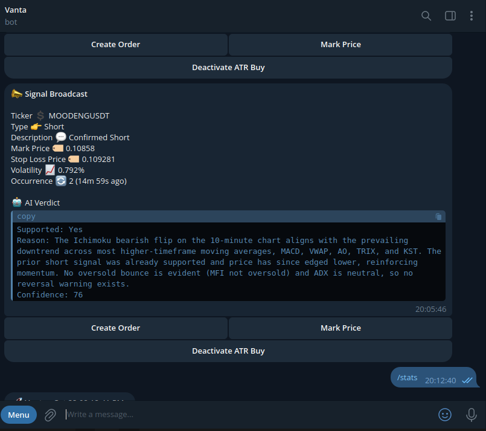

# BUFT (Bitget USDT-M Futures Trading / Telegram Bot)

<p align="center">
  
</p>

## Table of Contents

1. Introduction  
2. How It Works  
    - 7 Steps To Heaven (7STH) Trading Technical Analysis Algorithm  
    - How BUFT Works (Operational Flow)  
3. Features  
4. Engines and Modules  
5. Setup Prerequisites  
    - Telegram Bot Setup  
    - Bitget API Key Setup  
    - System Requirements  
6. Configuration  
7. Running the Bot  
8. Available Scripts  
9. Troubleshooting  
10. Contributing  
11. License

---

## Introduction

BUFT (Bitget USDT-M Futures Trading / Telegram bot) is an advanced, highly configurable trading bot for USDT-M futures on the Bitget Exchange. It exposes a private Telegram bot interface for configuration and real-time interaction. BUFT leverages configurable technical indicators, an opinionated multi-stage analysis algorithm (7 Steps To Heaven), optional LLM integration, and automation to generate and execute trade signals.

The bot is modular, lightweight, and stateless. It can recover active positions on restart, making it suitable for many hosting environments. BUFT supports live trading, real-time simulation (paper trading), and backtesting with historical data.

---

## How It Works

Before diving into the components, BUFT’s core technical analysis algorithm is the “7 Steps To Heaven” (7STH) algorithm. The algorithm accepts OHLCVT candle data and passes it through seven configurable stages to determine whether to release a long or short signal. Each stage may use multiple indicators and multiple granularities of candlestick data.

### 7 Steps To Heaven (7STH) — Trading Technical Analysis Algorithm

The 7STH algorithm is a sophisticated, configurable, optimized, scalable, self-auditing technical analysis pipeline used across my bots (including BUFT, Kinsman, Titan, Miko, and others). It is designed to produce accurate buy/sell (long/short) signals by evaluating market data across seven stages:

- It supports multiple concurrent granularities (for example, 1m, 5m, 15m, 1W, 1M). Indicators can be configured to use the granularity that best suits them.
- The algorithm runs periodically at the smallest configured granularity (for example, every minute). Each iteration ensures enough candlestick data is available for the requested granularities before analysis.
- Indicators and stages are configurable. Stages 2–5 can be ignored (their verdicts not applied) if desired.
- Progression to subsequent stages depends on the verdict of the current stage; final signals (with an LLM report if enabled) are released only after passing stage 7.
- The LLM report contains overall metadata and a step-by-step verdict including indicators used, parameters, and individual verdicts.
- The analysis phase uses a caching engine to cache consolidated candlestick data and intermediate indicator computations and to prepare an LLM-friendly report.

The seven steps:

#### Step 1: Signal Entry Generation
Uses primary entry indicators (for example Ichimoku Cloud, PSAR, MACD, Time Cycle) to detect potential bullish/bearish flips. These boundaries become entry points for long/short signals. The pipeline only proceeds if an entry is detected.

#### Step 2: Trend Confirmation
Uses multiple trend indicators (for example moving averages, MACD, Awesome Oscillator, TRIX) across multiple granularities concurrently. Boolean outputs from indicators are consolidated to a single confirmation value using logical AND, OR, or a ratio, per configuration. Progression depends on trend confirmation or if this step is configured to be ignored.

#### Step 3: Signal/Trend Strength
Uses ADX to detect trend strength and allows only signals on sufficiently strong trends, unless this step is ignored.

#### Step 4: Overbought / Oversold Reversal Detection
Detects overbought/oversold conditions relative to the signal direction. Supports multiple indicators (Stochastic Oscillator, Stoch RSI, RSI, CCI, MFI, etc.) and uses the same Boolean consolidation method as Step 2. Can be ignored if desired.

#### Step 5: Candlestick Pattern Reversal Detection
Checks for reversal candlestick patterns that contradict the signal. Supports many common candlestick patterns and multiple granularities. Uses Boolean consolidation and can be ignored.

#### Step 6: Stop Loss Calculation
Not a filter. Computes stop-loss based on a configured indicator (for example Ichimoku Cloud or PSAR) and chosen granularity. The stop-loss is later used to compute take-profit by applying the configured risk-reward ratio.

#### Step 7: Volatility Filter
Uses ATR (with configurable granularity) to compute market volatility and allows only signals whose volatility falls within the configured acceptable range. Signals that pass this step are released to downstream modules (execution, broadcasting).

Each stage is configurable, enabling rapid backtesting of numerous strategy combinations using the Collector module.

---

### How BUFT Works (Operational Flow)

1. Ticker Management  
    - Tickers (for example BTCUSDT, ETHUSDT) can be added or removed via the config file or the Telegram interface.

2. Monitoring Market Data and Signal Generation  
    - The 7STH algorithm runs on configured tickers to generate long/short signals.

3. Signal Filtering  
    - Intermediate modules ensure only the best signals are acted upon:
      - DupSig filters redundant signals.
      - SigSmooth delays signals that run counter to the overall market trend until the market aligns or the signal expires.

4. Signal Execution  
    - If auto trading is enabled, filtered signals can be executed against Bitget Futures to open positions.

5. Signal Broadcasting, LLM Integration, and Advanced Automated Limit Trading  
    - If broadcasting is enabled, BUFT composes prompts from the 7STH outputs and historical LLM outputs for pattern detection and an LLM verdict (confidence score, support flag, reason).
    - A Telegram alert is composed with the signal and verdict, allowing the user to execute the trade manually or to activate an “ATR buy”.
    - ATR Buy observes a signal until volatility breaks in favor or a Time Cycle model is detected within a configured window; signals are executed or discarded based on that logic. ATR Buy can be automated by configuration.

6. Manual Position Management and Telegram Interface  
    - The Telegram interface supports ticker management, instance status, position monitoring, and closing positions.
    - The interface can toggle automated trading and cancel ATR limit orders.
    - Alerts are sent to Telegram for events such as order creation, fills, and failures.

7. Automated Exit Strategies  
    - SL/TP features, automated limit sell orders, peak-drop (trailing stop loss) features, and damage-control behavior (closing positions when the market moves sharply against them) are supported.

---

## Features

- Automated Trading: Fully automated trading based on pre-configured strategies.
- Customizable Strategies: Configure entry, trend, and reversal indicators and granularities.
- Risk Management: Stop-loss, take-profit, and damage-control mechanisms.
- Telegram Integration: Real-time alerts and interaction via Telegram.
- Simulation Mode: Test strategies in a simulated environment without using real funds.
- Backtesting Support: Collect historical data for rapid strategy testing.
- LLM Integration: Optional integration with GROQ (or other LLM providers) for AI-based signal analysis.

---

## Engines and Modules

1. Core Engines

    - Signal Engine  
      - Files: engine/ticker.js, engine/analysis.js  
      - Responsibilities: Manages tickers, consolidates market data across granularities, runs the 7STH algorithm to generate signals.

    - Trade Engine  
      - Files: engine/trader.js, engine/bitget.js, engine/account.js  
      - Responsibilities: Executes trades, manages open positions and portfolio, implements stop-loss, take-profit, and other trading mechanics.

    - Telegram Engine  
      - File: engine/telegram.js  
      - Responsibilities: Handles user interactions via Telegram, accepts commands, and sends alerts.

    - Broadcast Engine  
      - File: engine/broadcast.js  
      - Responsibilities: Handles ATR-based limit orders, LLM inference, signal broadcasting, and damage control mechanisms.

2. Modules

    - DupSig: Filters duplicate signals to avoid redundant trades.
    - SigSmooth: Delays signals that move counter to the overall market trend.
    - Collector: Collects historical market data, runs backtests of configured algorithms, and aggregates results for analysis/visualization.
    - Finder: Scans and identifies suitable tickers for trading based on configured constraints.

---

## Setup Prerequisites

1. Telegram Bot Setup

    - Create and configure a Telegram bot using BotFather.
    - Obtain the bot token and the callback URL required in your configuration.
    - Obtain your Telegram account chat ID (for example using @userinfobot) so the bot can recognize and message your account.
    - Send at least one `/start` message from your account to the newly created bot to enable messaging (otherwise the bot cannot message you).

2. Bitget API Key Setup

    - Log in to your Bitget account.
    - Go to API Management and create a new HMAC API key.
    - Required permissions:
      - Trade
      - Market Data
    - Store the API key, secret, and passphrase securely.

3. System Requirements

    - Node.js: v20 or higher.
    - npm: v10 or higher.
    - Recommended OS: Linux/Unix for production deployments.

---

## System Requirements

- Node.js: v20 or higher
- npm: v10 or higher
- Recommended OS: Linux/Unix for production deployments

### Dependencies
Core dependencies:
- bitget-api v2.3.5 or higher - Official Bitget exchange API
- node-telegram-bot-api v0.66.0 or higher - Telegram bot functionality
- technicalindicators v3.1.0 or higher - Technical analysis library
- groq-sdk v0.25.0 or higher - For LLM integration
- express v5.1.0 or higher - Web server functionality
- dotenv v16.5.0 or higher - Environment configuration
- uuid v11.1.0 or higher - Unique identifier generation

### Initial Setup

1. Clone the repository
2. Install dependencies:
```bash
npm install
```
3. Copy `.env.sample` to `.env` and configure your environment variables
4. Proceed with the configuration steps in the next section

---

## Configuration

- BUFT uses a `.env` file for configuration. Refer to `.env.sample` for descriptions of each variable and recommended defaults.
- Important configuration areas:
  - Telegram bot token, chat ID, and polling vs webhook mode.
  - Bitget API key, secret, and passphrase.
  - Signal engine settings: configured indicators, granularities, enabled/disabled stages, and risk parameters.
  - Broadcasting and LLM configuration (provider, API key, prompt templates).
  - ATR Buy and automated trading toggles.
  - Logging and environment flags (PRODUCTION, FLOW_LOG_MAX_PRIORITY).

---

## Running the Bot

1. Install dependencies:

    ```bash
    npm install
    ```

2. Start the bot:

    ```bash
    npm start
    ```

3. Access and monitor the bot:

    - Default port: as specified in your `.env` file (default: 5000).
    - Monitor logs for real-time updates and signal activity.
    - Add or remove tickers and interact with the bot via the Telegram interface you configured.

---

## Available Scripts

The following npm scripts are available:

1. `npm start` - Start the main BUFT trading bot
2. `npm run col` - Run the Collector utility for backtesting and data collection
3. `npm run fin` - Run the Finder utility to scan for suitable trading pairs

### Collector Utility
The Collector utility (collector.js) is used for:
- Gathering historical market data
- Running backtests of your configured strategies
- Analyzing strategy performance
- Testing different indicator combinations
- Generating performance reports

### Finder Utility
The Finder utility (finder.js) helps identify suitable trading pairs by:
- Scanning available Bitget USDT-M futures pairs
- Analyzing trading volume and volatility
- Checking for minimum market criteria
- Suggesting pairs that match your configured requirements

---

## Troubleshooting

Common issues and steps to resolve them:

1. Bot fails to start
    - Ensure required environment variables are set in `.env`.
    - Run `npm install` to make sure dependencies are present.

2. Telegram notifications not working
    - Verify Telegram bot token and chat ID are correct.
    - Confirm you sent `/start` to the bot from your account.

3. Bitget API errors
    - Verify API key, secret, and passphrase.
    - Ensure the API key has required permissions (Trade, Market Data).

4. Unexpected behavior
    - Enable verbose / debug logs:
      - Set `FLOW_LOG_MAX_PRIORITY` to `-2`, or
      - Set `PRODUCTION=false` and `TG_POLLING=true` for more detailed logs in dev mode.
    - Inspect logs for error messages and stack traces.

---

## Contributing

Contributions are welcome.

1. Fork the repository.
2. Create a branch for your feature or bug fix.
3. Make changes and add tests where appropriate.
4. Submit a pull request with a clear description of your changes and motivation.

---

## License

This project is licensed under the MIT License.

---

For further assistance, feel free to reach out via Telegram or open an issue on the repository. Happy trading! 🚀